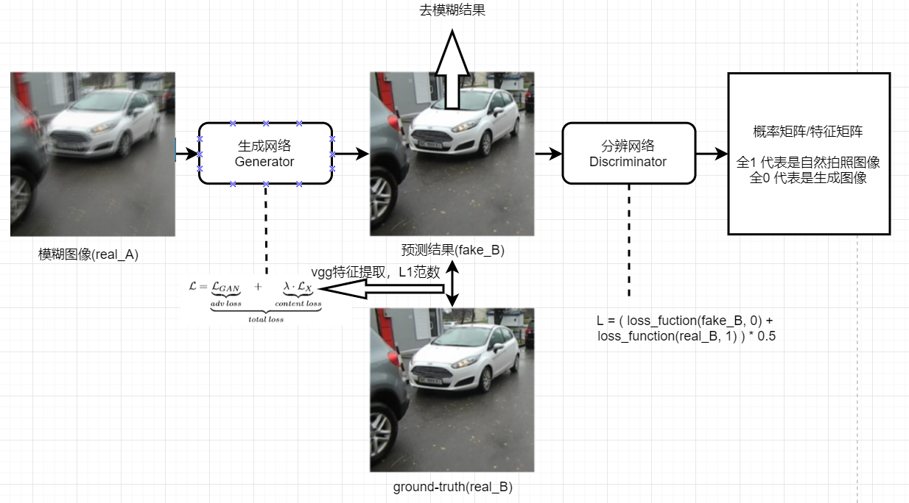
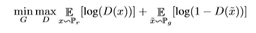
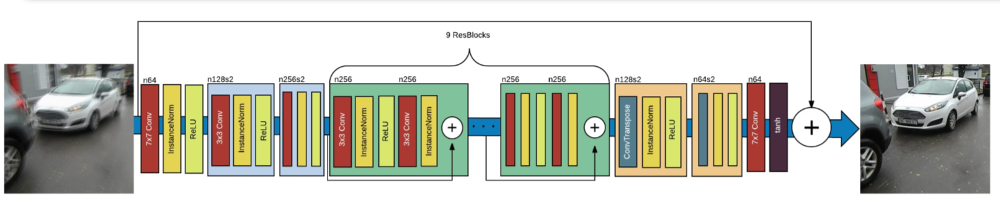
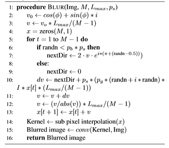
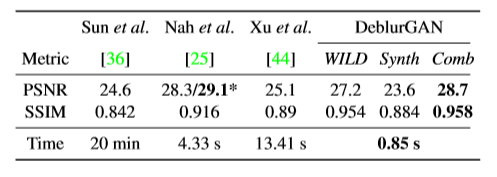
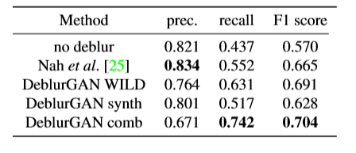

# 图像大作业（去模糊）论文综述&技术方案

石耕源 2015013219 

冯玉彤 2015013202 

谢运帷 2015013185

---

经过我们对于文献的研究和学习，我们将会主要介绍其中3篇对我们的技术方案有所指导的文章，并概述其他的文章。

#### 第一篇：DeblurGAN : Blind Motion Deblurring Using Conditional Adversarial Networks

这是推荐文献之中的第一篇，整体行文十分流畅，达到的效果也相当可圈可点。它使用了生成对抗网络来实现针对未知模糊核的图像的恢复。他们这样做主要是认为去模糊是一种图像到图像的转换，而这种转换，例如在风格迁移、分辨率扩大等问题上，GAN都有比较好的表现。除此之外，作者使用的Loss函数也是有多部分组成，既包含判断网络给出的结果，也包含去模糊后图像与ground-truth的差距。这样的设计在实践中效果更好。

这篇文章有三个突出的贡献：第一，它的处理速度很快，比当今的去模糊方法快了5倍以上；第二，它提出了一种生成数据的方法：模拟相机的运动，从清晰图片生成运动模糊图片，并将这种人工数据放入训练集中，可以加强去模糊的效果；第三，它提出了一种新的评价去模糊效果的评价函数，而这个评价函数是基于物体检测结果的。

---

我们来看一下这篇文章提出的生成对抗网络的结构：

根据GAN的理论，整个网络在求解下式：

既分辨网络D可以分辨出自然拍摄的清晰图像和预测出的去模糊图像，而生成网络G可以成和自然拍摄的清晰图像一样逼真的去模糊图像。这样，两者对抗的过程就可以使生成网络不断地进化，达到更好的去模糊效果。

整个网络地输入是模糊的拍摄图像，经过生成网络G得到了一个去模糊预测结果，随后又输入到分辨网络D中进行分辨。两个网络的优化过程是分开的，两者使用不同的Loss进行反向传播。生成网络的Loss定义，可以大致概括成这样，它包括一部分是：预测结果经过分辨网络D之后和1之间的距离，这反应了生成网络生成的图像有多逼真（越逼真代表越清晰）；另一部分是预测结果和ground-truth之间的内容距离，它定义为VGG19得到的feature_map之间的L2距离。而分辨网络D的Loss则定义为预测结果经过分辨网络之后和0的距离，以及ground-truth经过分辨网络之后和1的距离的均值，这样当分辨网络D的Loss下降时，既说明了分辨网络D可以分出预测图像和ground-truth图像。

上图就是生成网络G的具体结构，它由多个ResBlock堆叠而成。可以较好的提取特征和进行预测。

---

这样，整个网络的结构和训练过程就定义好了。现在缺乏的就是输入real_A的模糊图片和ground-truth real_B的对应组合了。作者提到，可以使用GoPro拍摄的数据集，其中2103组模糊和清晰图片的对应组；或者是Kohler数据集，其中有4幅图片，分别被12个模糊核影响。但是，这些数据集并不满足所有的需求——在很多场景下我们并没有模糊图片和清晰图片的对应。作者基于前人工作，总结出了新的模糊图片生成方法。

模糊图片的生成，前人提出了一些方法，诸如：高速相机连续两张图像的平均、用线性运动对应的模糊核进行模糊操作、用若干采样点模拟曲线来创造模糊核等等。本文更进一步，同样是采取随机点拟合曲线的方法来创造模糊核，它采的每一个点，是由上一个点的位置与速度，以及高斯扰动、强制扰动和惯性所决定的。文中也给出了这一步的算法。

---

实验部分，本文使用了三个数据集进行实验：

第一个是GoPro数据集的实验，在测试集上，本文的方法体现出了较好的峰值信噪比，比其他方法更好的结构相似性，从人眼的视觉上来讲结果也更好。

在第二个Kohler的数据集上，结果表现也和在GoPro数据集上的结果类似。

在第三个YOLO的数据集上，本文通过自己的模糊图片生成方法生成了多组街景和模糊街景的对照图片对，并通过自己的预测网络进行去模糊操作。再利用YOLO上一些预训练好的物体识别网络，来对比去模糊前和去模糊后不同的物体识别率，进而反应去模糊操作是否有效。

上述给出了DeblurGAN之后，去模糊图片的一些物体识别评价值。可以发现，DeblurGAN方法可以获得更好的recall和F1 score。本文评价这种利用物体识别方法来评价去模糊效果更好，更能反应人类的视觉效果，是否一个物体被还原的很清晰。

---

### Paper 3. Dynamic Scene Deblurring Using Spatially Variant Recurrent Neural Networks

**Background**

**Contribution**

**Method**

- IIR model
- network
- feature

**Experiment**

- dataset
- configuration
- comparison
- result

**Conclusion** 
>>>>>>> 8c5327026fbb4783c4828fe2956fdb9d601a731b
