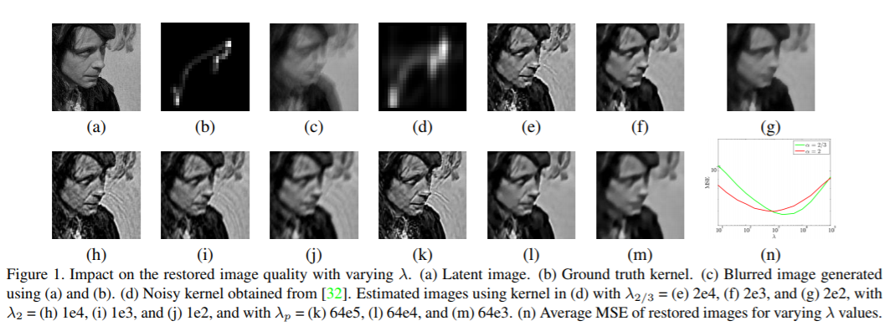

# 图像大作业（去模糊）论文综述&技术方案

石耕源 2015013219 

冯玉彤 2015013202 

谢运帷 2015013185

---

经过我们对于文献的研究和学习，我们将会主要介绍其中3篇对我们的技术方案有所指导的文章，并概述其他的文章。

### Paper 1：DeblurGAN : Blind Motion Deblurring Using Conditional Adversarial Networks

这是推荐文献之中的第一篇，整体行文十分流畅，达到的效果也相当可圈可点。它使用了生成对抗网络来实现针对未知模糊核的图像的恢复。他们这样做主要是认为去模糊是一种图像到图像的转换，而这种转换，例如在风格迁移、分辨率扩大等问题上，GAN都有比较好的表现。除此之外，作者使用的Loss函数也是有多部分组成，既包含判断网络给出的结果，也包含去模糊后图像与ground-truth的差距。这样的设计在实践中效果更好。

这篇文章有三个突出的贡献：第一，它的处理速度很快，比当今的去模糊方法快了5倍以上；第二，它提出了一种生成数据的方法：模拟相机的运动，从清晰图片生成运动模糊图片，并将这种人工数据放入训练集中，可以加强去模糊的效果；第三，它提出了一种新的评价去模糊效果的评价函数，而这个评价函数是基于物体检测结果的。

---

我们来看一下这篇文章提出的生成对抗网络的结构：

根据GAN的理论，整个网络在求解下式：

既分辨网络D可以分辨出自然拍摄的清晰图像和预测出的去模糊图像，而生成网络G可以成和自然拍摄的清晰图像一样逼真的去模糊图像。这样，两者对抗的过程就可以使生成网络不断地进化，达到更好的去模糊效果。

整个网络地输入是模糊的拍摄图像，经过生成网络G得到了一个去模糊预测结果，随后又输入到分辨网络D中进行分辨。两个网络的优化过程是分开的，两者使用不同的Loss进行反向传播。生成网络的Loss定义，可以大致概括成这样，它包括一部分是：预测结果经过分辨网络D之后和1之间的距离，这反应了生成网络生成的图像有多逼真（越逼真代表越清晰）；另一部分是预测结果和ground-truth之间的内容距离，它定义为VGG19得到的feature_map之间的L2距离。而分辨网络D的Loss则定义为预测结果经过分辨网络之后和0的距离，以及ground-truth经过分辨网络之后和1的距离的均值，这样当分辨网络D的Loss下降时，既说明了分辨网络D可以分出预测图像和ground-truth图像。

上图就是生成网络G的具体结构，它由多个ResBlock堆叠而成。可以较好的提取特征和进行预测。

---

这样，整个网络的结构和训练过程就定义好了。现在缺乏的就是输入real_A的模糊图片和ground-truth real_B的对应组合了。作者提到，可以使用GoPro拍摄的数据集，其中2103组模糊和清晰图片的对应组；或者是Kohler数据集，其中有4幅图片，分别被12个模糊核影响。但是，这些数据集并不满足所有的需求——在很多场景下我们并没有模糊图片和清晰图片的对应。作者基于前人工作，总结出了新的模糊图片生成方法。

模糊图片的生成，前人提出了一些方法，诸如：高速相机连续两张图像的平均、用线性运动对应的模糊核进行模糊操作、用若干采样点模拟曲线来创造模糊核等等。本文更进一步，同样是采取随机点拟合曲线的方法来创造模糊核，它采的每一个点，是由上一个点的位置与速度，以及高斯扰动、强制扰动和惯性所决定的。文中也给出了这一步的算法。

---

实验部分，本文使用了三个数据集进行实验：

第一个是GoPro数据集的实验，在测试集上，本文的方法体现出了较好的峰值信噪比，比其他方法更好的结构相似性，从人眼的视觉上来讲结果也更好。

在第二个K&ouml;hler的数据集上，结果表现也和在GoPro数据集上的结果类似。

在第三个YOLO的数据集上，本文通过自己的模糊图片生成方法生成了多组街景和模糊街景的对照图片对，并通过自己的预测网络进行去模糊操作。再利用YOLO上一些预训练好的物体识别网络，来对比去模糊前和去模糊后不同的物体识别率，进而反应去模糊操作是否有效。

上述给出了DeblurGAN之后，去模糊图片的一些物体识别评价值。可以发现，DeblurGAN方法可以获得更好的recall和F1 score。本文评价这种利用物体识别方法来评价去模糊效果更好，更能反应人类的视觉效果，是否一个物体被还原的很清晰。

---

### Paper 3. Dynamic Scene Deblurring Using Spatially Variant Recurrent Neural Networks

**Background**

本文主要针对的是相机震动和物体运动产生的模糊，是基于CNN的盲去模糊方法。文中使用RNN实现去卷积过程，并且针对现有CNN方法需要计算庞大的模型的问题提出解决方案，最终评价指标表现优秀。

**Contribution**

本文的贡献主要有三：

- 去卷积 RNN 网络的权重由 CNN 网络学习得到，最终产生端对端可训练的模型，能够应对多样化的模糊情况
- 将去模糊过程阐述为求解无限冲击响应 (Infinite Impulse Response, IIR) 模型问题，指出用 RNN 可以有效求解该问题，并具有较大感受野
- 实验表明该方法的精确度、速度、模型大小都优于最先进方法

**Method**

图像模糊的过程可以表示为
$$
y[n] = \sum_{m = 0}^M k[m]x[n-m] \tag{1}
$$
其中 $x$ 表示原始图像， $k$ 表示模糊核， $y$ 表示模糊后图像， $M$ 表示模糊核大小。可反解原图像 $x$ 为
$$
x[n] = \frac{y[n]}{k[0]} - \dfrac{\sum_{m=1}^M k[m]x[n-m]}{k[0]} \tag{2}
$$
 $x[n]$ 的表达中又含有序列前 $M$ 时刻的值。该方程可表示为信号处理领域的 IIR 模型。方程展开后可表示为对模糊信号 $y$ 作用逆滤波，而实验表明，逆滤波矩阵的参数比原模糊核的参数多很多，因此在使用基于 CNN 的去卷积方法时，需要使用较大的模型来提高感受野的范围。

同时注意到 $(2)$ 中实际上只有 $M$ 个参数需要求解，即 $k[m]$ 。使用 RNN 可以以较小的模型求解该问题。同时还需要在每个 RNN 网络之后加入 CNN 以融合不同方向学到的信息。

本文设计的网络结构如下。

先于 feature extraction 阶段使用卷积层提取原图像的 feature map ，后通过 weight generation 部分生成 RNN 网络的权重。将 feature map 通过四个 RNN 模块完成去卷积后重建图片并进行评价。

该网络结构的主要特点有：

- 每个 RNN 模块都考虑了四个方向，并在其后加入一个卷积层来聚合输出，提供了较大的感受野
- weight generation 部分除了最后一个之外的每个卷积层后面使用 ReLU 整流，最后一个卷积层后面使用双曲正切函数 ($\tanh$)，从而使权值分布在 $[0,1]$ 区间
- feature extraction，RNN deconvolution，reconstrucion 部分除了最后一个之外的每个卷积层后面加使用 负斜率为0.1的 Leaky ReLU 整流
- 重建部分使用双线性插值上采样，防止 grid artifact 问题
- 使用 skip link 以加快训练速度和防止梯度消失

**Experiment**

本文在GOPRO数据集[^1] 上进行了实验，与传统方法[2, 3, 4]，基于 CNN 的方法 [5, 6, 1] 进行了对比。

各方法的 PSNR (尖峰信噪比) 值、 SSIM (结构相似性) 值如下表所示。可见本文方法均优于其他方法。

|          | Whyte | Xu   | Sun  | Pan  | Liu  | Nah   | Gong | Proposed |
| -------- | ----- | ---- | ---- | ---- | ---- | ----- | ---- | -------- |
| PSNR     | 24.5  | 20.3 | 25.3 | 23.5 | 25.7 | 28.5  | 26.1 | **29.2** |
| SSIM     | 0.85  | 0.74 | 0.85 | 0.83 | 0.86 | 0.91  | 0.86 | **0.93** |
| time(s)  | 700   | 3800 | 1500 | 2500 |      | 15    | 1500 | **1.4**  |
| size(MB) |       |      | 54.1 |      |      | 303.6 | 41.2 | **37.1** |

在真实模糊数据集[^3]上，应用本文提出的方法生成的图像也比其他方法更加清晰。

---

### Paper 4 ：Learning a Discriminative Prior for Blind Image Deblurring

阅读此篇论文遇到了很大的困难，因为此论文的去模糊部分运用到了很多的数学，所以就简述一些整体的思路。

在一个盲的去模糊问题中，一个常用的方法即是求解上述优化问题。作者将问题分为对于I和k的两个子问题，使用迭代下降的方法，求解两个子问题，就得到了原清晰图像I和模糊核k。在求解上述优化问题的过程中，有一项$f(I)$，它表达的是这个此图像是否清晰。作者训练了一个CNN网络来计算这个$f(I)$。

这个分辨网络如下：

这个网络接受一张图片，输出1（模糊）或者0（清晰）。

作者主要在自己的随机生成的模糊核影响后的模糊图片上进行了实验，相比方法，它可以更准确的预测模糊核，达到了更好的效果。在现实拍摄的模糊图片上，也相对表现不错。

---

### Paper 6 ：Non-blind Deblurring: Handling Kernel Uncertainty with CNNs 

此篇意在解决一个重要的问题，在现实中，模糊核往往是有噪声的。在现有的非盲的去模糊方法中，都需要估计出一个准确的模糊核，才能保证最终恢复出的图像清晰。非盲的方法，使用一个MAP最大后验概率估计的方法，通过估计出的模糊核，来估计清晰的图像：

这样的方法，不光依赖我们选取的图像范数$P(l)$，还依赖这个超参数$\lambda$。作者给出了一组实验，证明了不同的$\lambda$和$P(l)$下，我们恢复的图像的效果不同。

在不同的$\lambda$下，利用有噪声的模糊核还原出的图片，有些细节更丰富却有人工的痕迹，有些细节不丰富但人工痕迹少。在这样的结果下，作者提出一种利用CNN把不同的还原结果综合一下，等到一个良好的去模糊结果的方法：

先通过不同超参数进行预测，得到不同的还原结果，在通过CNN网络进行提取特征，把特征组合起来，最终在换成一张图像，这张图像就是最终的还原结果，既保留了细节，有不会使其看起来有很多人工痕迹（纹理）。

---

## 参考文献

[^1]: Nah, Seungjun, Tae Hyun Kim, and Kyoung Mu Lee. "Deep multi-scale convolutional neural network for dynamic scene deblurring." *CVPR*. Vol. 1. No. 2. 2017.
[^2]: L. Xu, S. Zheng, and J. Jia. Unnatural l0 sparse representation for natural image deblurring. In CVPR, 2013.
[^3]: J. Pan, D. Sun, H. Pfister, and M.-H. Yang. Blind image deblurring using dark channel prior. In CVPR, 2016. 
[^4]: O. Whyte, J. Sivic, A. Zisserman, and J. Ponce. Non-uniform deblurring for shaken images. IJCV, 2012.
[^5]: J. Sun, W. Cao, Z. Xu, and J. Ponce. Learning a convolutional neural network for non-uniform motion blur removal. In CVPR, 2015. 
[^6]: D. Gong, J. Yang, L. Liu, Y. Zhang, I. Reid, C. Shen, A. v. d. Hengel, and Q. Shi. From motion blur to motion flow: a deep learning solution for removing heterogeneous motion blur. In CVPR, 2017. 
[^7]: S. Cho, J. Wang, and S. Lee. Video deblurring for hand-held cameras using patch-based synthesis. TOG, 2012. 

---

### 我们的技术方案：

经过讨论，我们将采用DeBlurGAN的整体结构，并且在它的基础上进行一些改进：

1、我们发现DeBlurGAN生成的图像的PSNR值相对低一些，而在调研中，RNN网络的文章生成的图像结果PSNR较好。我们考虑将生成网络G的部分进行修改和替换，进行对比实验。

2、我们发现去模糊得到的结果局部还是有些模糊，也有一些纹理问题，我们考虑使用滤波器来进一步消除这些细节问题

3、DeBlurGAN的判别网络D有些复杂，借鉴其他的文章2值的判别输出，我们会尝试对于此部分进行改进

4、尝试在野生的无对照数据集上进行训练和实验

我们整体的工作流程大概如下：

1、搜集数据集

2、编写新的生成网络model

3、编写新的判断网络

4、训练并实验

5、总结&展示